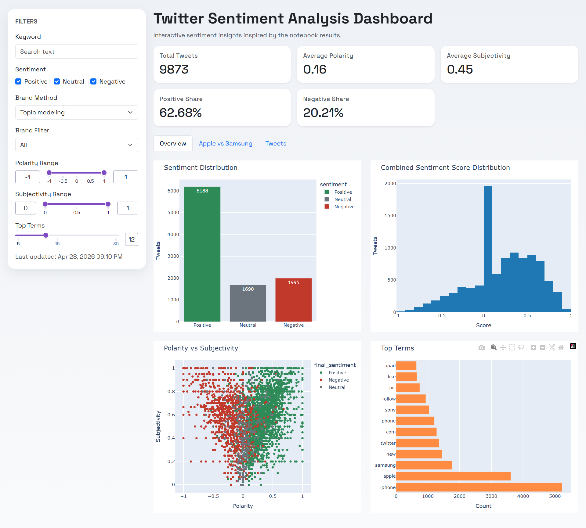

# Twitter Sentiment Analysis Dashboard



> An interactive Dash web application that analyzes Twitter sentiment using TextBlob and NLTK VADER, with rich filtering controls and multi-tab visualizations.

---

## Table of Contents

1. [Features](#features)
2. [Tech Stack](#tech-stack)
3. [Project Structure](#project-structure)
4. [Sentiment Analysis Methods](#sentiment-analysis-methods)
5. [Getting Started](#getting-started)
6. [Usage](#usage)
7. [Contributing](#contributing)
8. [License](#license)

---

## Features

- **Dataset-driven analysis** – Loads tweets from `Dataset/twitter_dataset.csv` for consistent, reproducible insights.
- **Dual sentiment scoring** – Combines TextBlob polarity and NLTK VADER compound scores into a single composite score.
- **Interactive filters** – Keyword search, sentiment class, brand, polarity range, and subjectivity range.
- **KPI cards** – Total tweets, average polarity, average subjectivity, positive share, and negative share at a glance.
- **Rich visualisations**:
  - Sentiment distribution & score distribution charts
  - Polarity vs. subjectivity scatter plot
  - Top-terms visualisation (NMF topic model)
- **Apple vs. Samsung comparison** – Side-by-side brand snapshots and direct sentiment split.
- **Tweet browser** – Top positive / negative tweets plus a fully filterable tweet table.

---

## Tools and Tech Stack

| Library | Version | Purpose |
|---|---|---|
| [Dash](https://dash.plotly.com/) | 4.1.0 | Web application framework |
| [Dash Bootstrap Components](https://dash-bootstrap-components.opensource.faculty.ai/) | 2.0.4 | Responsive UI components |
| [Plotly](https://plotly.com/python/) | 6.7.0 | Interactive charts |
| [Pandas](https://pandas.pydata.org/) | 3.0.2 | Data manipulation |
| [TextBlob](https://textblob.readthedocs.io/) | 0.20.0 | Polarity & subjectivity scoring |
| [NLTK](https://www.nltk.org/) | 3.9.4 | VADER sentiment scoring & tokenisation |
| [scikit-learn](https://scikit-learn.org/) | 1.8.0 | TF-IDF & NMF topic modelling |
| [Gunicorn](https://gunicorn.org/) | latest | Production WSGI server |
| [Python](https://python.org/) | latest | Programming Language |

 **Copilot** – For Documenting on Readme File

---

## Project Structure

```
Sentimental-analysis/
├── app_from_notebook.py      # Main Dash application
├── Dataset/
│   └── twitter_dataset.csv   # Input tweet dataset
├── Sentiment_analysis.ipynb  # Exploratory notebook
├── DashApp.png               # Dashboard screenshot
├── requirements.txt          # Python dependencies
├── Procfile                  # Deployment process file (Gunicorn)
└── README.md                 # This file
```

---

## Sentiment Analysis Methods

### TextBlob

TextBlob provides two properties for each piece of text:

| Property | Range | Meaning |
|---|---|---|
| **Polarity** | −1.0 → +1.0 | Negative → Positive sentiment |
| **Subjectivity** | 0.0 → 1.0 | Objective → Subjective |

Both values are used as filter dimensions and shown in KPI cards.

### NLTK VADER (Valence Aware Dictionary and sEntiment Reasoner)

VADER is a lexicon and rule-based sentiment tool specifically tuned for social-media text. It returns four scores:

| Score | Description |
|---|---|
| **pos** | Proportion of text rated positive |
| **neu** | Proportion of text rated neutral |
| **neg** | Proportion of text rated negative |
| **compound** | Normalised composite score: −1 (most negative) → +1 (most positive) |

The app combines TextBlob polarity and VADER compound by averaging them into a single **sentiment score** used for classification and comparison.

---

## Getting Started

### Prerequisites

- Python 3.8 or higher
- `pip` package manager

### Installation

1. **Clone the repository**

   ```bash
   git clone https://github.com/PHPDEV-OPS/Sentimental-analysis.git
   cd Sentimental-analysis
   ```

2. **Install dependencies**

   ```bash
   pip install -r requirements.txt
   ```

3. **Download NLTK data** *(first run only)*

   ```bash
   python -c "import nltk; nltk.download('vader_lexicon'); nltk.download('punkt'); nltk.download('punkt_tab'); nltk.download('stopwords'); nltk.download('wordnet')"
   ```

4. **Verify the dataset** – Ensure `Dataset/twitter_dataset.csv` is present.

### Running the Dashboard

```bash
python app_from_notebook.py
```

Then open **http://127.0.0.1:8050/** in your browser.

---

## Usage

| Tab | What you can do |
|---|---|
| **Filters panel** | Filter by keyword, sentiment class, brand, polarity range, and subjectivity range |
| **Overview** | View KPI cards, sentiment distribution, score distribution, and polarity vs. subjectivity scatter |
| **Apple vs. Samsung** | Compare brand-level snapshots and sentiment splits side-by-side |
| **Tweets** | Browse top positive / negative tweets and explore the filtered tweet table |

---

## Contributing

Contributions are welcome! Please follow these steps:

1. Fork the repository.
2. Create a feature branch: `git checkout -b feature/your-feature-name`
3. Commit your changes: `git commit -m "Add your feature"`
4. Push to your fork: `git push origin feature/your-feature-name`
5. Open a Pull Request describing your changes.

Please ensure your code is clean and well-documented before submitting.

---

## License

This project is open-source. See the repository for licence details or contact the maintainer for more information.
